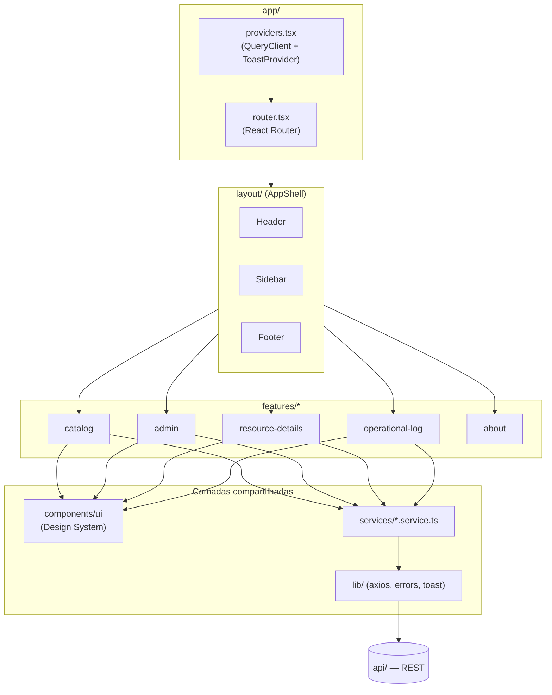
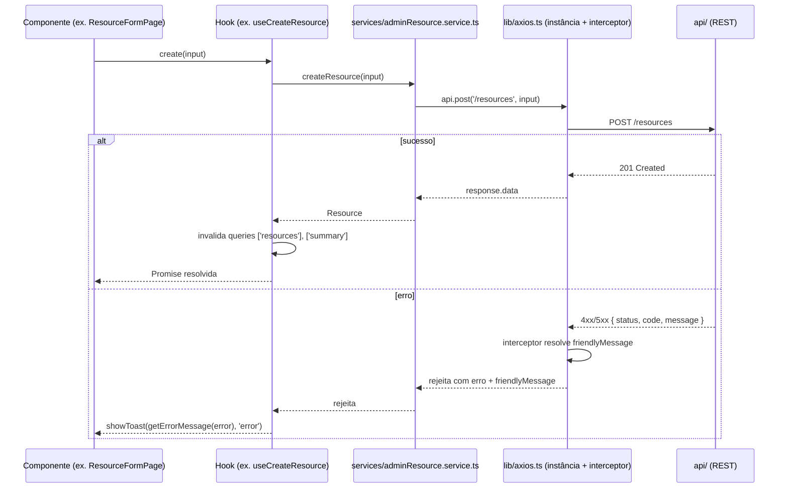

# Buni API Hub — Web

Frontend em React/TypeScript/Vite do Portal de Serviços: consulta, pesquisa, filtros, favoritos e cadastro/manutenção (CRUD) do catálogo de APIs, Web Services e Sites.

> Repositório: `buni-api-hub-web` · Parte do ecossistema **Buni API Hub** (`api/` — backend). A `ingestion/` é uma ferramenta auxiliar de importação em lote usada apenas pela `api/`; o Web não tem qualquer dependência dela. O Painel Operacional (NOC, tela de TV) é um frontend independente (`dashboard/`), fora deste repositório — ver [README do `dashboard/`](../dashboard/README.md). O Web consome, além do catálogo, o endpoint de auditoria `GET /dashboard/events` (feature `operational-log`) — só leitura, sem qualquer outra dependência do domínio de monitoramento.

---

## Sumário

- [Visão geral](#visão-geral)
- [Objetivo](#objetivo)
- [Arquitetura](#arquitetura)
- [Stack tecnológica](#stack-tecnológica)
- [Estrutura de diretórios](#estrutura-de-diretórios)
- [Rotas](#rotas)
- [Organização das features](#organização-das-features)
- [Design System (`components/ui`)](#design-system-componentsui)
- [Fluxo Frontend → Backend](#fluxo-frontend--backend)
- [Tratamento de erros e mensagens](#tratamento-de-erros-e-mensagens)
- [Sistema de Toast global](#sistema-de-toast-global)
- [Estado e cache de dados](#estado-e-cache-de-dados)
- [Variáveis de ambiente](#variáveis-de-ambiente)
- [Como executar localmente](#como-executar-localmente)
- [Build e deploy](#build-e-deploy)
- [Padrões arquiteturais e boas práticas](#padrões-arquiteturais-e-boas-práticas)
- [Fluxo de desenvolvimento](#fluxo-de-desenvolvimento)
- [Roadmap / melhorias futuras](#roadmap--melhorias-futuras)
- [Licença](#licença)

---

## Visão geral

Este projeto é exclusivamente o **Portal de Serviços** (`/`, `/apis`, `/web-services`, `/sites`, `/favoritos`, `/cadastro-recursos/*`, `/log-operacional`, `/sobre`) — voltado ao usuário final: consultar, pesquisar, favoritar e (para quem administra o catálogo) cadastrar/editar/excluir recursos. Não há tela de monitoramento em tempo real (gauge, KPIs, TV) neste repositório — isso é o Painel Operacional, um projeto à parte (`dashboard/`), que consome a mesma API de forma totalmente independente. O Web tem, no entanto, uma tela de **auditoria** (`Log Operacional`) que lê os eventos de transição de status já persistidos pela `api/` — o **Log Operacional** propriamente dito (`events.json`, distinto do **Histórico Operacional**/`history.json`, que é só métricas e série temporal, consumido pelo `dashboard/`) — sem duplicar nenhuma lógica de monitoramento.

**Responsabilidade do Portal:**

- Consulta, pesquisa e filtros do catálogo.
- Favoritos (100% client-side).
- CRUD administrativo — criar, editar, visualizar e excluir recursos (Cadastro de Recursos).

**O que o Portal explicitamente não faz:**

- **Não possui regras de negócio** — duplicidade, geração de `id`/`searchIndex`, validação de payload: tudo acontece na `api/`. O Frontend só envia o que o usuário digitou e exibe a resposta.
- **Não possui persistência própria** — nenhum dado sobrevive fora da API, à exceção dos favoritos (`localStorage`, explicitamente client-side e fora do domínio do catálogo).
- **Consome exclusivamente a API** — toda a aplicação fala com o backend via REST (`api/`) e nunca acessa arquivos ou dados diretamente; os dados exibidos refletem sempre o estado atual da API, nunca uma cópia local. O Frontend não conhece nem depende da `ingestion/` — essa ferramenta é interna à `api/` e não integra o fluxo do Portal (ver [README da `api/`](../api/README.md#fluxo-dos-dados)).

```
Usuário
   ↓
Frontend React
   ↓
API REST
   ↓
Catálogo de Recursos
```

## Objetivo

Dar ao usuário final uma forma rápida de localizar um serviço já catalogado e, a quem mantém o catálogo, um jeito de cadastrar/atualizar recursos sem depender de deploy — enquanto a equipe de operações acompanha a saúde de tudo isso em tempo real numa única tela.

## Arquitetura

Arquitetura *Feature-Based*: cada funcionalidade vive em `src/features/<nome>/` com seus próprios `components/`, `hooks/` e um `index.ts` como barrel público — outras camadas só importam a partir desse barrel, nunca de um caminho interno da feature (regra de lint própria, `no-restricted-imports`).



## Stack tecnológica

| Categoria | Tecnologia |
|---|---|
| Framework UI | React ^19.2 |
| Linguagem | TypeScript ~6.0 (`strict`) |
| Build tool | Vite ^8.1 (`@vitejs/plugin-react`) |
| Roteamento | React Router ^7.18 (`createBrowserRouter`) |
| Estado de servidor / cache | TanStack Query ^5.101 (+ Devtools em dev) |
| HTTP client | Axios ^1.18 |
| Estilo | Tailwind CSS ^4.3 (`@tailwindcss/vite`, tema via `@theme` em CSS) |
| Validação de env | Zod ^4.4 |
| Lint/format | ESLint 10 (flat config, `react-hooks` + `react-refresh`) + Prettier (`prettier-plugin-tailwindcss`) |

Não há framework de testes configurado (sem Vitest/Testing Library).

## Estrutura de diretórios

```
web/
├── src/
│   ├── app/
│   │   ├── App.tsx               # AppProviders + RouterProvider
│   │   ├── providers.tsx         # QueryClientProvider + ToastProvider
│   │   ├── router.tsx            # todas as rotas
│   │   └── legacyRedirects.tsx   # redirects de URLs antigas com :id dinâmico
│   ├── assets/
│   │   ├── images/
│   │   └── styles/index.css      # tema Tailwind v4 (@theme)
│   ├── components/ui/            # Design System (ver seção própria)
│   ├── config/
│   │   └── env.ts                # validação Zod de VITE_API_BASE_URL
│   ├── features/
│   │   ├── about/
│   │   ├── admin/                # Cadastro de Recursos (CRUD)
│   │   ├── catalog/               # Portal — busca, filtros, favoritos
│   │   ├── operational-log/       # Log Operacional — auditoria (GET /dashboard/events)
│   │   └── resource-details/
│   ├── layout/
│   │   ├── AppShell.tsx  Header.tsx  Sidebar.tsx  Footer.tsx  Logo.tsx  PageContainer.tsx
│   ├── lib/
│   │   ├── axios.ts               # instância única + interceptor global de erro
│   │   ├── errors.ts              # getErrorMessage()
│   │   ├── apiErrorMessage.ts     # resolveApiErrorMessage() — lógica central
│   │   ├── httpStatusMessages.ts  # mapa de mensagens por status HTTP
│   │   ├── toastMessages.ts       # SUCCESS_MESSAGES centralizadas
│   │   ├── clipboard.ts
│   │   └── queryClient.ts
│   ├── routes/
│   │   ├── paths.ts               # fonte única de todas as URLs da app
│   │   └── index.ts
│   ├── services/
│   │   ├── resource.service.ts  adminResource.service.ts  summary.service.ts
│   │   └── health.service.ts  operationalLog.service.ts
│   ├── main.tsx
│   └── vite-env.d.ts
├── vite.config.ts
├── eslint.config.js
├── tsconfig.app.json / tsconfig.node.json
└── package.json
```

## Rotas

Definidas centralmente em `routes/paths.ts` e registradas em `app/router.tsx`. **Nenhum módulo é representado por query parameter** — `type`/`favoritos` são rotas de verdade; só filtros temporários (`search`, `environment`, `status`) continuam em query string.

| Rota | Dentro do AppShell? | Página | Descrição |
|---|---|---|---|
| `/` | Sim | `CatalogPage` (`view="all"`) | Catálogo completo |
| `/apis` | Sim | `CatalogPage` (`view="api"`) | Só APIs |
| `/web-services` | Sim | `CatalogPage` (`view="web-service"`) | Só Web Services |
| `/sites` | Sim | `CatalogPage` (`view="site"`) | Só Sites |
| `/favoritos` | Sim | `CatalogPage` (`view="favorites"`) | Só recursos favoritados |
| `/resource/:resourceId` | Sim | `ResourceDetailsPage` | Detalhe de um recurso |
| `/sobre` | Sim | `AboutPage` | Página institucional |
| `/cadastro-recursos` | Sim | `AdminResourcesPage` | Listagem administrativa (CRUD) |
| `/cadastro-recursos/novo` | Sim | `ResourceFormPage` (`mode="create"`) | Criar recurso |
| `/cadastro-recursos/:resourceId` | Sim | `ResourceViewPage` | Visualizar recurso (admin) |
| `/cadastro-recursos/:resourceId/editar` | Sim | `ResourceFormPage` (`mode="edit"`) | Editar recurso |
| `/log-operacional` | Sim | `OperationalLogPage` | Auditoria — histórico de transições de status |

**Compatibilidade com URLs antigas** — redirecionam automaticamente (`<Navigate replace>`), sem renderizar tela própria:

- `/admin/recursos*` → `/cadastro-recursos*` (rotas antigas do módulo administrativo).
- `/?type=api` \| `web-service` \| `site` → `/apis` \| `/web-services` \| `/sites`.
- `/?favorites=1` → `/favoritos`.

## Organização das features

Cada feature em `src/features/<nome>/` segue o mesmo formato: `components/`, `hooks/` (quando há lógica reaproveitável), arquivos utilitários locais e um `index.ts` — o único ponto de importação permitido para quem está fora da feature.

### `catalog/` — Portal, consulta pública

- **`CatalogPage`** recebe `view` (definida pela rota) e deriva `type`/`favoritesOnly` internamente — não lê isso de query string.
- Filtros de `search`/`environment`/`status` via `useCatalogFilters` (query string, `useSearchParams`, sempre com `{replace:true}`).
- Pipeline client-side: `useResources()` (catálogo completo) → filtro por favoritos (se aplicável) → `filterResources()` (tipo/ambiente/busca via `searchIndex`) → filtro por `status` (usando o health de cada recurso) → paginação (`PAGE_SIZE = 30`).
- **Favoritos**: `favoritesStore.ts` — external store próprio (Set + `localStorage`, chave `buni-api-hub:favorites`), consumido via `useSyncExternalStore` em `useFavorites()`. 100% client-side, sem endpoint de favoritos na API.
- **Status de saúde**: `useResourcesHealth()` busca `GET /health/resources` uma vez para toda a tabela, com `refetchInterval` de 60s.
- `ResourceSummaryGrid` mostra 4 cards (API/Web Service/Site — de `GET /summary` — e Favoritos, calculado no cliente).
- **Planejado**: o `SortFilter` (ordenação por Nome/Última atualização/Tipo) existe visualmente mas ainda não está conectado a nenhuma lógica de ordenação — é decorativo hoje.

### `admin/` — Cadastro de Recursos (CRUD)

- `AdminResourcesPage` — tabela densa (componente `Table` do Design System), filtros locais (`useFilters`, em memória, não em URL), ordenação por Nome/Última atualização, paginação de 30 itens.
- `ResourceFormPage` (`mode: create | edit`) — formulário único em seções (Informações Gerais, Endereço, Organização, Configuração, Observações); no modo `create` há o botão "Salvar e Novo".
- `ResourceViewPage` — leitura, com atalho para edição.
- `DeleteResourceModal` — confirmação antes de excluir.
- Mutações (`useCreateResource`, `useUpdateResource`, `useDeleteResource`) usam `useMutation` do TanStack Query e invalidam as queries `['resources']`/`['summary']` no sucesso, mantendo o Portal sincronizado sem recarregar a página.

### `operational-log/` — Log Operacional (auditoria)

- `OperationalLogPage` — tabela (componente `Table` do Design System, mesmo padrão de `AdminResourcesPage`) com todas as transições de status já registradas pela `api/`: data/hora, recurso, tipo, status anterior → novo status, motivo (com mensagem de erro real e duração da indisponibilidade quando existirem, exibidas como linhas secundárias), tempo de resposta e código HTTP.
- **Filtros**: recurso, ambiente, status e período (`De`/`Até`) via `useOperationalLogFilters` — vão para o servidor como query string de `GET /dashboard/events` (`resourceId`/`status`/`environment`/`since`/`until`), reduzindo o payload conforme `events.json` cresce. Pesquisa por texto (recurso/motivo) continua client-side, aplicada sobre o resultado já filtrado pelo servidor — não existe `search=` na API.
- `useOperationalLog(filters)` — cada combinação de filtros estruturados é uma entrada própria de cache do TanStack Query (`queryKey: ['dashboard','events', filters]`); sem polling (é uma tela de auditoria, não um painel ao vivo). Paginação client-side com o mesmo `Pagination` do Design System, sobre o resultado já filtrado (servidor + busca).
- **Exportação** (`export/`) — botão "Exportar" gera um CSV (`operationalLogCsv.ts`, com BOM UTF-8 para abrir corretamente no Excel) só dos registros filtrados na tela, via `downloadFile.ts` (mecânica de download genérica, reutilizável). `exportOperationalLog(events, format)` já é despachado por um registro de exportadores (`OPERATIONAL_LOG_EXPORTERS`) — adicionar Excel/PDF no futuro é só registrar um novo serializer, sem tocar na tela.
- Não introduz persistência nem endpoint novo — é o único ponto do Web que lê algo do domínio `/dashboard*`, e o faz só em modo leitura.

### `resource-details/`

- `ResourceDetailsPage` — detalhe completo de um recurso (`GET /resources/:id`), com favoritar, copiar URL, compartilhar link e abrir em nova aba.

### `about/`

- `AboutPage` — página institucional estática.

## Design System (`components/ui`)

Componentes genéricos, sem conhecimento de domínio, cada um em sua própria pasta com barrel próprio:

| Componente | Propósito |
|---|---|
| `Badge` | Rótulo pequeno — variantes `neutral`/`success`/`danger`/`warning` |
| `Button` | Variantes `primary`/`secondary`/`ghost`, tamanhos `sm`/`md`/`lg` |
| `Card` | Container com borda/sombra padrão |
| `EmptyState` | Estado vazio genérico (ícone + título + descrição + ação opcional) |
| `Input` / `Textarea` / `Select` | Campos de formulário com `label`, `error`, tamanhos `md`/`sm` |
| `Modal` | Diálogo modal simples |
| `Pagination` | Paginação (`page`/`pageCount`/`onPageChange`) |
| `Skeleton` | Placeholder de carregamento |
| `Table` | Tabela genérica reutilizável — colunas com largura/alinhamento/ordenação configuráveis |
| `Toast` + `ToastProvider` | Sistema de notificação global (ver seção própria) |
| `Tooltip` | Dica contextual, acessível via teclado |
| `ComingSoonPage` | Placeholder para funcionalidades futuras |

## Fluxo Frontend → Backend

Todo acesso à API passa pela mesma instância Axios (`lib/axios.ts`) e por uma camada de `services/` — **nenhuma página chama `fetch`/`axios` diretamente**.



## Tratamento de erros e mensagens

Interceptor de resposta global em `lib/axios.ts`: toda falha de requisição passa por ele **uma única vez**, que calcula a mensagem amigável (`resolveApiErrorMessage`, em `lib/apiErrorMessage.ts`) e a anexa ao erro (`error.friendlyMessage`) antes de propagar — nenhuma tela precisa reimplementar essa lógica.

Prioridade de resolução da mensagem:

1. **Mensagem enviada pelo backend** (`error.response.data.message`, do envelope `{status, code, message}` da API) — sempre a primeira opção.
2. **Timeout** (`error.code === 'ECONNABORTED'` ou mensagem contendo "timeout") → mensagem fixa de timeout.
3. **Sem resposta do servidor** (erro de rede) → mensagem fixa de conexão.
4. **Mapa por status HTTP** (`lib/httpStatusMessages.ts`, cobre 400/401/403/404/409/422/429/500/502/503/504) — rede de segurança, usada só se o backend não mandar `message`.
5. **Fallback do chamador** (parâmetro opcional de `getErrorMessage(error, fallback)`) — usado apenas para erros que não vieram do Axios.

`lib/errors.ts` (`getErrorMessage`) é a função pública consumida por todos os hooks — mantém a mesma assinatura desde antes dessa camada existir, então nenhum hook precisou mudar quando o interceptor foi introduzido.

## Sistema de Toast global

`ToastProvider` (`components/ui/Toast/`) é montado **uma única vez**, acima do `RouterProvider` (em `app/providers.tsx`) — por isso um toast disparado imediatamente antes de um redirect (ex.: "Recurso cadastrado com sucesso." seguido de voltar para a listagem) continua visível na tela seguinte, em vez de ser perdido no unmount da página de origem.

- `useToast()` expõe `showToast(message, variant?)`, `variant` ∈ `success` (default) `| info | warning | error`, cada um com cor e ícone próprios.
- Mensagens de sucesso centralizadas em `lib/toastMessages.ts` (`SUCCESS_MESSAGES`): cadastro, edição, exclusão, favoritar/desfavoritar, copiar URL/link.

## Estado e cache de dados

TanStack Query é a única fonte de estado de servidor — sem Redux/Zustand/Context próprio para dados remotos. `staleTime` padrão de 30s (`lib/queryClient.ts`), `retry: 1`. Query keys usadas: `['resources']`, `['resource', id]`, `['summary']`, `['health', 'resources']`. Mutações do módulo administrativo invalidam `['resources']` e `['summary']` no sucesso — o Portal reflete a mudança sem reload manual.

Estado verdadeiramente local (favoritos) usa `localStorage` diretamente, fora do React Query, por não ser um dado de servidor.

## Variáveis de ambiente

| Variável | Obrigatória | Default | Descrição |
|---|---|---|---|
| `VITE_API_BASE_URL` | Não | `http://localhost:3333` | URL base da API consumida pelo frontend |

Validada via Zod em `config/env.ts` — falha rápida (erro fatal com mensagem detalhada) se definida com um valor que não seja uma URL válida. O `.env.example` do repositório aponta para uma URL de produção (`https://buni-api-hub.onrender.com`), então em desenvolvimento local normalmente se sobrescreve essa variável para apontar para a API local.

## Como executar localmente

Pré-requisitos: Node.js compatível com Vite 8/TypeScript 6, npm, e a API (`api/`) rodando (local ou remota).

```bash
cd web
cp .env.example .env       # ajuste VITE_API_BASE_URL para sua API local, se necessário
npm install
npm run dev                 # Vite dev server, http://localhost:5173
```

Outros scripts:

```bash
npm run typecheck    # tsc -b --noEmit
npm run lint          # eslint .
npm run lint:fix
npm run format        # prettier --write .
npm run preview        # serve o build de produção localmente
```

Não há suíte de testes automatizados configurada.

## Build e deploy

```bash
npm run build   # tsc -b (typecheck) + vite build → dist/
```

O resultado é um conjunto de arquivos estáticos (`dist/`) — qualquer servidor de arquivos estáticos ou CDN serve a aplicação, desde que configurado para redirecionar todas as rotas para `index.html` (SPA fallback), já que o roteamento é 100% client-side via React Router.

Não há pipeline de CI/CD, Dockerfile ou configuração de deploy versionada neste repositório. O `.env.example` referencia uma URL de API hospedada no Render, o que sugere o ambiente de produção alvo, mas a configuração de hospedagem em si não está neste repositório.

## Padrões arquiteturais e boas práticas

- **Feature-Based Architecture** com barrel público obrigatório por feature, reforçada por regra de lint (`no-restricted-imports`) que impede importar um caminho interno de outra feature.
- **Camada de serviços dedicada** (`services/*.service.ts`) — nenhum componente chama Axios/`fetch` diretamente.
- **Tratamento de erro centralizado** via interceptor Axios + resolver único, evitando duplicação de lógica de mensagens em cada tela.
- **Toast global** em vez de estado de toast duplicado por página.
- **Tipagem forte de ponta a ponta**, com o modelo `Resource` espelhando manualmente o do backend (`api/src/models/resource.model.ts`).
- **Rotas semânticas** — nenhum módulo do sistema é representado por query parameter; query string reservada só para filtros/paginação temporários.
- **Design System isolado** (`components/ui`) sem conhecimento de domínio, reaproveitado por todas as features.

## Fluxo de desenvolvimento

1. Nova página → cria-se a feature (ou se estende uma existente) em `features/`, com rota registrada em `routes/paths.ts` + `app/router.tsx`.
2. Nova chamada à API → adiciona-se função em `services/*.service.ts`; nunca chamar `api` (Axios) diretamente de um componente.
3. Novo componente de UI reutilizável entre features → `components/ui/`; específico de uma feature → dentro da própria feature.
4. `npm run typecheck && npm run lint` antes de qualquer commit.
5. Sem testes automatizados — validação manual via `npm run dev` é o processo atual.

## Roadmap / melhorias futuras

> Itens listados aqui **não estão implementados** — documentados para transparência sobre a direção do projeto, não como funcionalidade existente.

- **Ordenação funcional** no Catálogo (`SortFilter` hoje é decorativo).
- **Endpoint de favoritos no backend** — hoje é 100% `localStorage`, não sincroniza entre dispositivos/sessões.
- **Autenticação** — não há login nem controle de acesso ao módulo de Cadastro de Recursos.
- **Testes automatizados** (unitários e de integração de componentes).
- **Pipeline de CI/CD** (build, typecheck, lint, deploy automatizados).
- **Breadcrumbs genéricos** — hoje só a tela de detalhe do recurso tem navegação estrutural própria.

Melhorias específicas do Painel Operacional (monitoramento) estão priorizadas no [README do `dashboard/`](../dashboard/README.md) e em [`api/docs/dashboard-operacional.md`](../api/docs/dashboard-operacional.md#melhorias-futuras) — não fazem parte deste repositório.

## Licença

Não há arquivo de licença (`LICENSE`) neste repositório. Projeto proprietário/interno — uso restrito à organização, salvo indicação contrária de quem administra o repositório.
