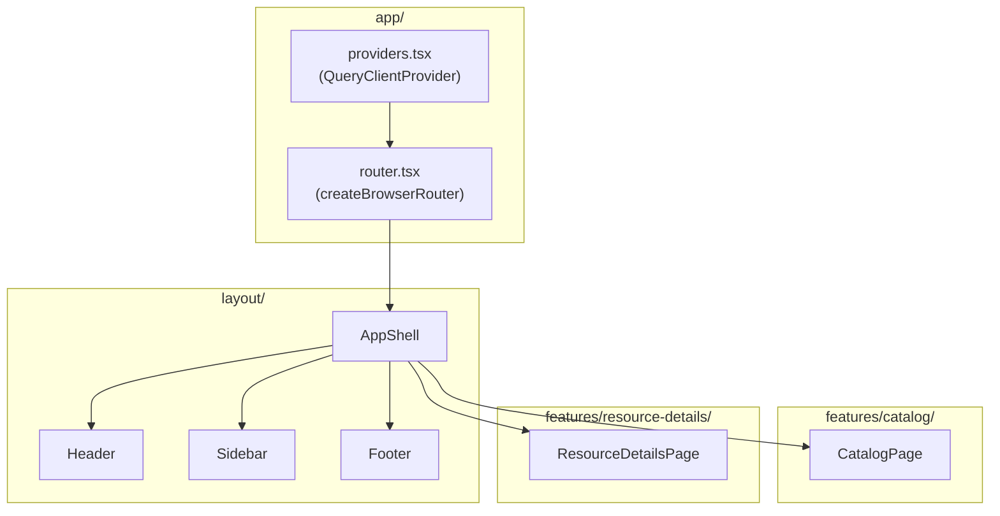
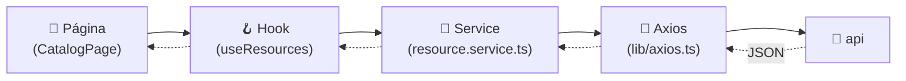
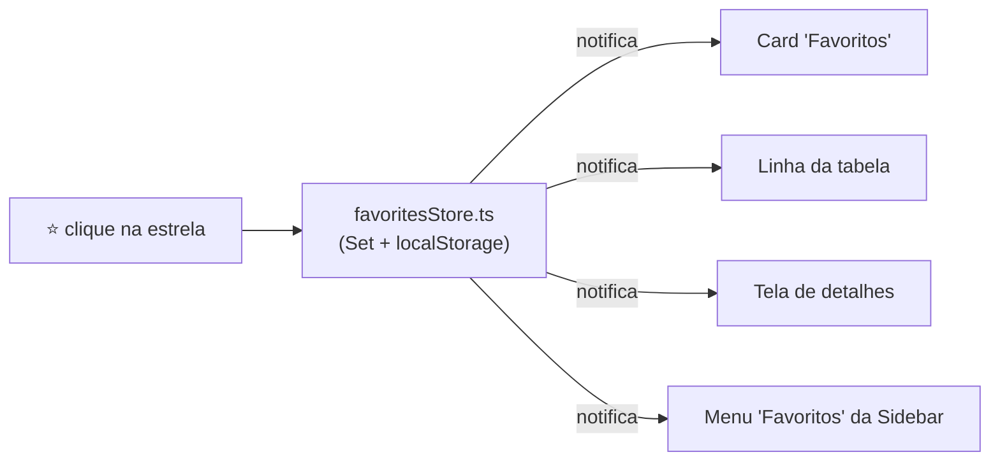

<div align="center">

# 💻 web

**Frontend do Buni API Hub — busca, filtra, favorita e exibe a saúde de cada API, Web Service e Site da plataforma.**


</div>

---

## 📑 Índice

- [Objetivo](#-objetivo)
- [Funcionalidades](#-funcionalidades)
- [Feature-Based Architecture](#-feature-based-architecture)
- [Fluxo de dados](#-fluxo-de-dados)
- [Modelo de domínio](#-modelo-de-domínio)
- [Roteamento e persistência de estado na URL](#-roteamento-e-persistência-de-estado-na-url)
- [React Query: cache e configuração](#-react-query-cache-e-configuração)
- [Favoritos](#-favoritos)
- [Health Check no frontend](#-health-check-no-frontend)
- [Busca](#-busca)
- [Componentes de UI compartilhados](#-componentes-de-ui-compartilhados)
- [Estrutura de pastas](#-estrutura-de-pastas)
- [Variáveis de ambiente](#-variáveis-de-ambiente)
- [Como executar](#-como-executar)
- [Scripts disponíveis](#-scripts-disponíveis)
- [➕ Como criar uma página nova](#-como-criar-uma-página-nova)
- [➕ Como criar um hook novo](#-como-criar-um-hook-novo)
- [➕ Como consumir um endpoint novo](#-como-consumir-um-endpoint-novo)
- [➕ Como criar um componente novo](#-como-criar-um-componente-novo)
- [Boas práticas](#-boas-práticas)

---

## 🎯 Objetivo

A interface que o desenvolvedor da Buni realmente usa: buscar um recurso pelo nome (amigável ou técnico), filtrar por tipo/ambiente/status, ver se está no ar agora, favoritar o que usa com frequência e copiar/abrir a URL em um clique — tudo consumindo a [`api/`](../api/README.md) via REST, sem nenhuma lógica de negócio duplicada no cliente além do que é puramente de apresentação.

---

## ✨ Funcionalidades

| Funcionalidade                                                                        | Status                                                                   |
| ------------------------------------------------------------------------------------- | ------------------------------------------------------------------------ |
| Catálogo de APIs, Web Services e Sites                                                | ✅                                                                       |
| Busca por nome amigável, nome técnico, palavra-chave ou URL                           | ✅                                                                       |
| Filtros por Tipo, Ambiente e Status                                                   | ✅                                                                       |
| Favoritos (persistidos no navegador)                                                  | ✅                                                                       |
| Status de saúde em tempo (quase) real                                                 | ✅                                                                       |
| Tela de detalhes por recurso                                                          | ✅                                                                       |
| Copiar URL / Abrir URL em nova aba                                                    | ✅                                                                       |
| URL da página como fonte de verdade dos filtros (compartilhável, sobrevive a refresh) | ✅                                                                       |
| Restauração de scroll ao voltar                                                       | ✅                                                                       |
| Skeleton loading                                                                      | ✅                                                                       |
| Empty states dedicados (sem favoritos, sem resultados de busca)                       | ✅                                                                       |
| Toast de sucesso/erro                                                                 | ✅                                                                       |
| Tooltips acessíveis (mouse e teclado)                                                 | ✅                                                                       |
| Sidebar colapsável                                                                    | ✅                                                                       |
| Ordenação (`Ordenar por`)                                                             | 🚧 decorativo — ver [roadmap do README principal](../README.md#-roadmap) |

---

## 🏛️ Feature-Based Architecture

O código é organizado por **domínio de tela**, não por tipo técnico de arquivo. Cada feature expõe só um barrel público (`index.ts`) — importar um arquivo interno de outra feature é bloqueado por uma regra própria de ESLint (`no-restricted-imports` em `@/features/*/*`).



| Camada                       | O que vive lá                                                                                                                    | Pode ser importado por outras features? |
| ---------------------------- | -------------------------------------------------------------------------------------------------------------------------------- | --------------------------------------- |
| `app/`                       | Bootstrap: `App`, `providers` (React Query), `router`                                                                            | —                                       |
| `layout/`                    | `Header`, `Sidebar`, `Footer`, `AppShell`, `PageContainer` — aparecem em toda rota                                               | —                                       |
| `components/ui/`             | Design system genérico: `Button`, `Card`, `Badge`, `Select`, `Skeleton`, `Toast`, `Tooltip`, `EmptyState`, ícones compartilhados | Sim, livremente                         |
| `features/catalog/`          | Busca, filtros, tabela, cards de resumo, favoritos, status de saúde                                                              | Só via `index.ts` (barrel)              |
| `features/resource-details/` | Tela de detalhes de um recurso                                                                                                   | Só via `index.ts` (barrel)              |
| `lib/`                       | `axios`, `queryClient`, tratamento de erro compartilhado, clipboard                                                              | Sim, livremente                         |
| `services/`                  | Chamadas HTTP — **única camada que conhece Axios**                                                                               | Sim, é a fronteira com o backend        |
| `config/`                    | Validação (Zod) das variáveis de ambiente                                                                                        | Sim                                     |

---

## 🔄 Fluxo de dados



Nenhum componente conhece Axios — só os **hooks** (via React Query) e, por baixo deles, os **services**. Isso é o que permite trocar a implementação de rede sem tocar em nenhum componente.

| Camada  | Exemplo                                                                           | Responsabilidade                                                         |
| ------- | --------------------------------------------------------------------------------- | ------------------------------------------------------------------------ |
| Página  | `CatalogPage.tsx`                                                                 | Orquestra hooks, compõe os componentes visuais                           |
| Hook    | `useResources`, `useSummary`, `useResourcesHealth`, `useResource`, `useFavorites` | React Query (cache, loading, erro) ou `useSyncExternalStore` (Favoritos) |
| Service | `resource.service.ts`, `summary.service.ts`, `health.service.ts`                  | Uma função por chamada HTTP, sem estado                                  |
| Axios   | `lib/axios.ts`                                                                    | Instância única, `baseURL` vinda de `VITE_API_BASE_URL`                  |

---

## 🧬 Modelo de domínio

`features/catalog/types.ts` espelha manualmente `ingestion/src/types.ts` / `api/src/models/resource.model.ts` — os três projetos são independentes, sem pacote compartilhado.

```ts
export type ResourceType = 'api' | 'web-service' | 'site'
export type ResourceEnvironment = 'homologacao' | 'producao' | 'unknown'
export type ResourceStatus = 'online' | 'slow' | 'offline' | 'unknown'

export interface Resource {
  id: string
  type: ResourceType
  displayName?: string // nome principal, quando a origem traz um
  name: string
  technicalName: string
  code?: string
  url?: string
  environment: ResourceEnvironment
  category?: string
  deprecated: boolean
  active: boolean
  description?: string
  keywords: string[]
  tags: string[]
  searchIndex: string[]
}
```

> [!TIP]
> **Nunca use `resource.name` ou `resource.displayName` diretamente na UI.** Use sempre `getResourceDisplayName(resource)` (`features/catalog/getResourceDisplayName.ts`) — ele resolve `displayName ?? name` num único lugar.

---

## 🧭 Roteamento e persistência de estado na URL

Duas rotas (`app/router.tsx`):

| Path                    | Página                |
| ----------------------- | --------------------- |
| `/`                     | `CatalogPage`         |
| `/resource/:resourceId` | `ResourceDetailsPage` |

Busca, Tipo, Ambiente, Status e "somente Favoritos" **não vivem em `useState`** — vivem na URL (`useCatalogFilters`, via `useSearchParams` do React Router):

```
/?search=cliente&type=api&environment=homologacao&status=online&favorites=1
```

Isso é o que permite atualizar a página, copiar o link e voltar da tela de detalhes sem perder o que estava filtrado. Todas as escritas usam `{ replace: true }` — um filtro digitado letra a letra não vira uma pilha de entradas no histórico do navegador.

> [!WARNING]
> `useSearchParams` do React Router calcula o estado anterior a partir do render atual — **duas chamadas síncronas de `setSearchParams` no mesmo clique se atropelam**, porque a segunda parte do mesmo estado desatualizado que a primeira. Por isso existe `setView(type, favoritesOnly)`: sempre que mais de um parâmetro precisa mudar junto (ex.: a Sidebar trocando de "visão"), a atualização é uma **única** chamada.

A `Sidebar` trata Início/APIs/Web Services/Sites/Favoritos como um único grupo mutuamente exclusivo — selecionar qualquer um sai de qualquer outro, evitando o estado inconsistente de "favoritesOnly preso" já corrigido no histórico do projeto.

---

## 🔄 React Query: cache e configuração

```ts
// lib/queryClient.ts
new QueryClient({
  defaultOptions: {
    queries: {
      staleTime: 30_000,
      retry: 1,
      refetchOnWindowFocus: true,
    },
  },
})
```

| Hook                 | `queryKey`                | Particularidade                                                                                                                               |
| -------------------- | ------------------------- | --------------------------------------------------------------------------------------------------------------------------------------------- |
| `useResources`       | `['resources']`           | Catálogo completo — filtros (tipo/ambiente/busca/status) são aplicados **no cliente**, não via query params                                   |
| `useSummary`         | `['summary']`             | Cards de resumo                                                                                                                               |
| `useResourcesHealth` | `['health', 'resources']` | `refetchInterval: 60_000` — o **mesmo intervalo** do sweep do backend; devolve um `Map<resourceId, ResourceHealth>` já pronto pra lookup O(1) |
| `useResource(id)`    | `['resource', id]`        | `enabled: Boolean(id)`; um 404 vira `resource: undefined`, não um erro genérico                                                               |

> [!NOTE]
> `refetchOnWindowFocus: true` existe por um motivo concreto: se a API cair no instante em que uma query falha, ela entra em erro permanente (sem `refetchInterval` para `/resources`/`/summary`) — voltar o foco pra aba é o gatilho padrão do React Query pra tentar de novo, evitando que o usuário precise dar F5 manualmente.

Erros de rede viram mensagem amigável via `lib/errors.ts` (`getErrorMessage`), que prioriza o `{ error: string }` devolvido pelo `errorHandler` da API sobre o texto técnico do Axios.

---

## ⭐ Favoritos

Guardados no **`localStorage`** do navegador (`buni-api-hub:favorites`), sem nenhuma chamada ao backend — puramente client-side.



- `favoritesStore.ts` é um _external store_ simples (Set em memória + `localStorage`), com um pub/sub próprio — o evento `storage` do navegador só dispara em **outras** abas, então esse pub/sub é quem avisa os componentes da própria aba.
- `useFavorites()` lê esse store via `useSyncExternalStore` do React — qualquer componente que chame o hook atualiza **instantaneamente** quando qualquer outro favorita/desfavorita, sem prop drilling.
- Clicar em "Favoritos" na Sidebar filtra a tabela para mostrar só os favoritados (`?favorites=1`); com zero favoritos, aparece um Empty State dedicado com um botão para voltar ao catálogo completo.

---

## ❤️ Health Check no frontend

O status de cada recurso (🟢 Online / 🟡 Lento / 🔴 Offline / ⚪ Desconhecido) vem de `GET /health/resources` — uma **única chamada** para a tabela inteira (`useResourcesHealth`), nunca uma por linha:

```ts
const { healthByResourceId } = useResourcesHealth() // Map<resourceId, ResourceHealth>
```

- Cor e rótulo de cada status vêm de `RESOURCE_STATUS_CONFIG` (`features/catalog/constants.ts`) — **fonte única de verdade**, reaproveitada pelo `ResourceStatusBadge` (tabela e tela de detalhes) e pelo `StatusFilter` (as opções do filtro são geradas a partir desse mesmo objeto, então um status novo adicionado ali aparece no filtro automaticamente).
- Falha na chamada de health (ou recurso que ainda não passou pela primeira varredura) cai no fallback `'unknown'` — a tabela nunca quebra por falta desse dado.
- Detalhes de como o status é calculado: [api/README.md#-health-check](../api/README.md#-health-check).

---

## 🔎 Busca

Um único campo de texto livre (`SearchBar`), aplicado sobre `resource.searchIndex` — array já normalizado (minúsculo, sem acento) gerado pela [`ingestion/`](../ingestion/README.md#-como-o-searchindex-funciona):

```ts
// filterResources.ts
function matchesSearchTerm(resource: Resource, searchTerm: string): boolean {
  const words = normalizeSearchTerm(searchTerm).split(/\s+/).filter(Boolean)
  return words.every((word) => resource.searchIndex.some((entry) => entry.includes(word)))
}
```

Cada palavra digitada precisa aparecer em **alguma** entrada do `searchIndex` (AND entre palavras, OR dentro de cada palavra) — digitar `"consulta banco"` encontra `"Consulta de Bancos"` sem exigir substring exata. `normalizeSearchTerm.ts` no frontend usa a **mesma normalização** que a `ingestion/` usa para montar o índice — precisam ser idênticas para o termo digitado bater com o que foi indexado.

---

## 🧩 Componentes de UI compartilhados

| Componente   | Uso                                                                                                    |
| ------------ | ------------------------------------------------------------------------------------------------------ |
| `Button`     | Variantes `primary` / `secondary` / `ghost`, tamanhos `sm` / `md` / `lg`                               |
| `Card`       | Container com borda/sombra padrão                                                                      |
| `Badge`      | Pill de texto (Tipo, Ambiente, Tags, Keywords)                                                         |
| `Select`     | `<select>` nativo estilizado, sempre controlado (`value`/`onChange`)                                   |
| `Skeleton`   | Bloco de loading genérico — a forma vem de `className` de quem consome                                 |
| `Toast`      | `variant: 'default' \| 'error'`, sem fila/provider global (um disparo por tela)                        |
| `Tooltip`    | CSS puro (`group-hover`/`group-focus-within`) — funciona no mouse e no teclado                         |
| `EmptyState` | Ícone + título + descrição + ação opcional — não sabe se é "sem favoritos" ou "sem resultado de busca" |
| `icons.tsx`  | `CopyIcon`, `StarIcon`, `ExternalLinkIcon` — reutilizados entre a tabela e a tela de detalhes          |

---

## 📁 Estrutura de pastas

```text
web/
└── src/
    ├── app/                       Bootstrap: App, providers (React Query), router
    ├── components/ui/              Design system genérico (ver tabela acima)
    ├── config/env.ts               Validação (Zod) de VITE_API_BASE_URL
    ├── features/
    │   ├── catalog/
    │   │   ├── components/          CatalogPage, SearchBar, FilterBar, ResourceTable, cards...
    │   │   ├── hooks/                useCatalogFilters, useResources, useResourcesHealth, useFavorites, useSummary
    │   │   ├── constants.ts          Labels e config de status (fonte única de verdade)
    │   │   ├── types.ts              Modelo de domínio (espelha o backend)
    │   │   ├── filterResources.ts    Filtro puro por tipo/ambiente/busca
    │   │   ├── getResourceDisplayName.ts
    │   │   ├── favoritesStore.ts     External store de favoritos (Set + localStorage)
    │   │   └── index.ts              Barrel público
    │   └── resource-details/
    │       ├── components/           ResourceDetailsPage, ResourceDetailsSkeleton
    │       ├── hooks/useResource.ts
    │       └── index.ts
    ├── layout/                      Header, Sidebar, Footer, AppShell, PageContainer
    ├── lib/                         axios, queryClient, errors, clipboard
    ├── routes/                      paths.ts (definição centralizada de rotas)
    └── services/                    resource.service, summary.service, health.service
```

---

## ⚙️ Variáveis de ambiente

| Variável            | Default                 | Descrição                              |
| ------------------- | ----------------------- | -------------------------------------- |
| `VITE_API_BASE_URL` | `http://localhost:3333` | Base URL da [`api/`](../api/README.md) |

---

## ▶️ Como executar

```bash
cd web
npm install
cp .env.example .env   # ajuste se a api/ não estiver em localhost:3333
npm run dev
```

> [!IMPORTANT]
> Requer a [`api/`](../api/README.md) no ar — este projeto não lê nenhum arquivo estático local, todo dado vem da API real via HTTP.

## 📜 Scripts disponíveis

| Comando                | Descrição                                     |
| ---------------------- | --------------------------------------------- |
| `npm run dev`          | Sobe o servidor de desenvolvimento (Vite)     |
| `npm run build`        | Typecheck + build de produção em `dist/`      |
| `npm run preview`      | Serve o build de produção localmente          |
| `npm run typecheck`    | Verifica os tipos com `tsc -b --noEmit`       |
| `npm run lint`         | Roda o ESLint                                 |
| `npm run lint:fix`     | Roda o ESLint corrigindo o que for corrigível |
| `npm run format`       | Formata o projeto com Prettier                |
| `npm run format:check` | Verifica formatação sem alterar arquivos      |

---

## ➕ Como criar uma página nova

1. Crie a feature em `features/minha-feature/` (`components/`, `hooks/` se precisar, `types.ts` se tiver modelo próprio, `index.ts` como barrel).
2. Adicione o path em `routes/paths.ts`.
3. Registre a rota em `app/router.tsx`, como filha do `AppShell`.
4. Exporte só o componente de página pelo barrel — o resto da feature é implementação interna.

## ➕ Como criar um hook novo

Um hook de dados é uma casca fina sobre `useQuery`, devolvendo um formato simples e estável para o componente:

```ts
export function useAlgumaCoisa() {
  const query = useQuery({ queryKey: ['algo'], queryFn: getAlgo })
  return {
    dado: query.data,
    isLoading: query.isLoading,
    error: query.isError ? getErrorMessage(query.error, 'Mensagem amigável.') : null,
  }
}
```

## ➕ Como consumir um endpoint novo

1. **Service** — uma função async por chamada, em `services/`, usando a instância `api` de `lib/axios.ts`. Nenhum componente deve importar Axios diretamente.
2. **Hook** — encapsule o service num hook de `useQuery` (ou `useMutation`, se vier a existir uma escrita).
3. **Componente** — consuma só o hook.

```
Componente → Hook (React Query) → Service (Axios) → api/
```

## ➕ Como criar um componente novo

- Genérico, sem conhecimento de domínio (ex.: um novo primitivo visual) → `components/ui/`.
- Específico de uma tela (ex.: um card novo do catálogo) → dentro da feature correspondente, em `components/`.
- Reaproveite ícones/tokens de cor já existentes (`assets/styles/index.css`, `@theme`) antes de criar um novo.

---

## ✅ Boas práticas

- ✔️ Componentes nunca importam `axios` — sempre através de um hook.
- ✔️ Outras features só se importam pelo barrel (`@/features/catalog`, nunca `@/features/catalog/components/X`) — regra reforçada por ESLint.
- ✔️ Filtros/busca/favoritos vivem na URL ou no `localStorage`, nunca em `useState` solto — é isso que torna tudo compartilhável e sobrevivente a refresh.
- ✔️ Rode `npm run typecheck && npm run lint && npm run build` antes de qualquer PR.
- ❌ Não duplique a lógica de "qual nome mostrar" — use sempre `getResourceDisplayName`.
- ❌ Não crie um segundo lugar com os rótulos/cores de status — use `RESOURCE_STATUS_CONFIG`.

---

<div align="center">

[⬅ api/README.md](../api/README.md) · [🏠 README principal](../README.md)

</div>
